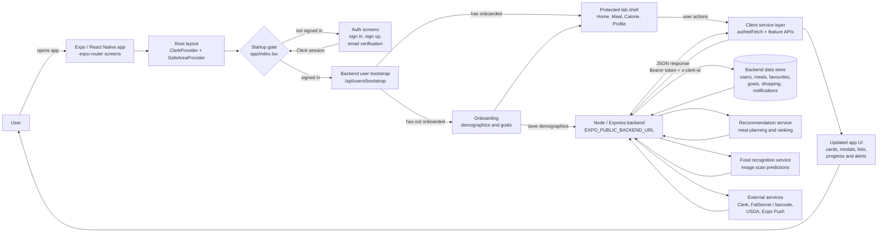

# GoodHealthMate Mobile App

This folder contains the Expo / React Native mobile client for GoodHealthMate. It is the user-facing app for account setup, onboarding, meal discovery, food logging, calorie tracking, food recognition, favourites, shopping lists, notifications, profile management, and feedback.

## Mobile App Flow

The app is intentionally thin on secrets and business logic. It keeps user interaction on the phone, uses Clerk for identity, sends authenticated requests to the Node / Express backend, and lets the backend coordinate database writes, recommendations, food recognition, nutrition lookups, and push-notification state.



Request contract:

1. The app starts inside `app/_layout.tsx`, which provides Clerk auth, safe-area support, global routing, and a readable configuration failure when the Clerk key is missing.
2. `app/index.tsx` decides whether to send the user to auth, onboarding, or the protected tab experience.
3. Signed-in users are bootstrapped against the backend through `services/userSync.ts`, so the app knows whether their backend profile already exists and whether onboarding is complete.
4. Feature screens call service files under `services/` rather than building network requests directly.
5. `services/authedFetch.ts` attaches the Clerk bearer token, keeps the temporary `x-clerk-id` compatibility header, applies JSON headers, and performs one gentle retry for rate-limited non-file requests.
6. The backend owns private data, recommendation work, food recognition proxying, external API calls, and push-notification persistence.

## Core Product Areas

- Account and authentication through Clerk.
- Onboarding for demographics, health goals, and initial personalisation.
- Home dashboard with profile, calorie summary, favourite meals, and recent activity.
- Meal planning, recommendations, recipe detail, favourites, and shopping lists.
- Calorie goal creation, saved goals, and daily summary views.
- Food recognition from an image, with prediction results and correction feedback.
- Barcode and food search flows through backend-proxied nutrition services.
- Profile editing, notification preferences, privacy controls, feedback, and account deletion.

## Route Structure

The app uses `expo-router`, so screens are organised by folder.

```text
meal_app/app/
  _layout.tsx                 Root provider shell
  index.tsx                   Startup and account bootstrap gate
  (auth)/                     Sign in, sign up, email verification
  (onboarding)/               Demographic and preference setup
  (tabs)/                     Protected main app shell
    index.tsx                 Home dashboard
    meal/                     Planning, recipes, favourites, summary, shopping
    calorie/                  Goals, saved goals, calorie summary
    profile/                  Profile, privacy, feedback, notification settings
```

## Service Layer

| File | Responsibility |
| --- | --- |
| `services/authedFetch.ts` | Shared authenticated backend request helper. |
| `services/userSync.ts` | Creates or fetches the backend user record after Clerk login. |
| `services/recommendation.ts` | Recommendation fetch, warmup, caching, feedback, and image prefetch support. |
| `services/planning.network.ts` | Meal-plan preferences, recommendation events, and meal logging calls. |
| `services/foodRecognitionAPI.ts` | Converts a local image URI to base64 and calls `/api/food-recognition/predict`. |
| `services/feedbackAPI.ts` | Sends app feedback and food-recognition correction feedback. |
| `services/mealAPI.tsx` | FatSecret-backed food search and nutrition helper logic. |
| `services/barcodeAPI.tsx` | Barcode lookup support. |
| `services/*Store.ts` | Local feature state helpers for home, favourites, meal summaries, notifications, and profile flows. |

## Main Backend Calls

The app is configured through `EXPO_PUBLIC_BACKEND_URL` and calls backend routes such as:

- `/api/users/bootstrap`
- `/api/demographics/save`
- `/api/profile/:clerkId`
- `/api/meals/add`
- `/api/meals/add-batch`
- `/api/meals/recent/:clerkId`
- `/api/calorie/summary/:clerkId/:date`
- `/api/calorie/list/:clerkId`
- `/api/favorites/list/:clerkId`
- `/api/shopping/...`
- `/api/meal-plan/preferences/:clerkId`
- `/api/meal-plan/recommendations/:clerkId`
- `/api/meal-plan/events`
- `/api/food-recognition/predict`
- `/api/food-recognition/feedback`
- `/api/feedback/submit`
- `/api/devices/register`
- `/api/notifications/...`

The backend details are documented in [../backend/README.md](../backend/README.md). The food recognition service is documented in [../food_recognition/README.md](../food_recognition/README.md).

## Tech Stack

- Expo SDK 54
- React 19 and React Native 0.81
- TypeScript
- Expo Router
- Clerk Expo authentication
- NativeWind and Tailwind CSS
- Expo Camera and Image Picker
- Expo Notifications
- Expo Secure Store
- AsyncStorage
- React Native SVG and Expo Vector Icons

## Environment Variables

Copy `.env.example` to `.env` for local development.

| Variable | Required | Purpose |
| --- | --- | --- |
| `EXPO_PUBLIC_BACKEND_URL` | Yes | Public HTTPS backend base URL used by `utils/config.ts` and `authedFetch`. |
| `EXPO_PUBLIC_CLERK_PUBLISHABLE_KEY` | Yes | Clerk publishable key for mobile authentication. |
| `EXPO_PUBLIC_EAS_PROJECT_ID` | Optional | Push-token project override when `app.json` is not enough. |
| `EXPO_PUBLIC_EXPERIENCE_ID` | Recommended for push setup | Expo experience identifier used by notification registration. |

Release builds should not point `EXPO_PUBLIC_BACKEND_URL` at localhost, `127.0.0.1`, or private LAN addresses. `app/index.tsx` blocks that configuration outside development builds so TestFlight users do not get stuck on a local backend.

## Local Development

```powershell
cd meal_app
npm install
npm start
```

Useful scripts:

```powershell
npm run android
npm run ios
npm run web
npm run lint
```

For a physical phone, the backend URL in `.env` must be reachable from the device. For hosted testing, use the deployed backend URL rather than a local machine URL.

## Build And Release Notes

- `app.json` contains Expo app identity, plugins, splash/icon config, and platform-specific settings.
- `eas.json` contains EAS build profiles.
- Clerk keys and backend URLs should be set in the EAS environment for production builds.
- Expo push registration happens through `components/NotificationSetup.tsx` and is sent to the backend device-registration route.
- Startup status messages are logged in `app/index.tsx` to make TestFlight troubleshooting easier.

## Project Structure

```text
meal_app/
  app/            Expo Router screens and layouts
  components/     Reusable UI components, modals, cards, and setup helpers
  services/       API clients, auth-aware fetch helpers, and feature stores
  utils/          Shared configuration helpers
  assets/         Images, icons, and theme resources
  app.json        Expo app configuration
  eas.json        EAS build profiles
  package.json    Scripts and dependency manifest
```

## How It Fits Into GoodHealthMate

The mobile app is the orchestration point for the user experience, but not the place where trusted business decisions live. It collects user intent, displays fast feedback, and sends authenticated requests to the backend. The backend then coordinates persistence, recommendations, food recognition, nutrition sources, notifications, and account operations, returning stable JSON that the app can render into focused mobile workflows.
